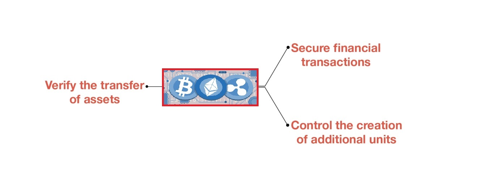
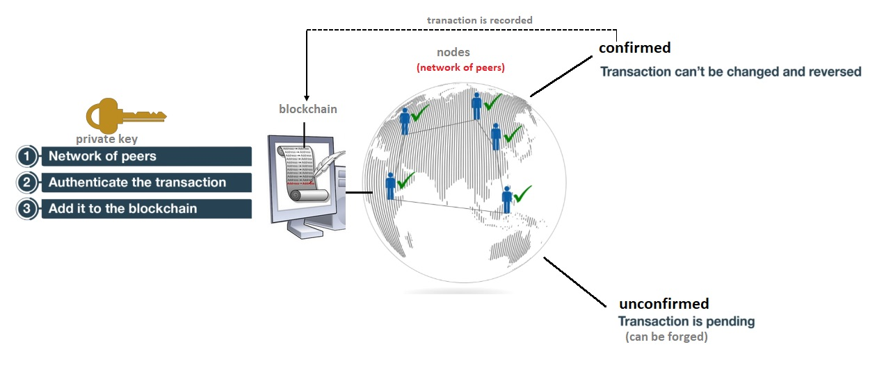
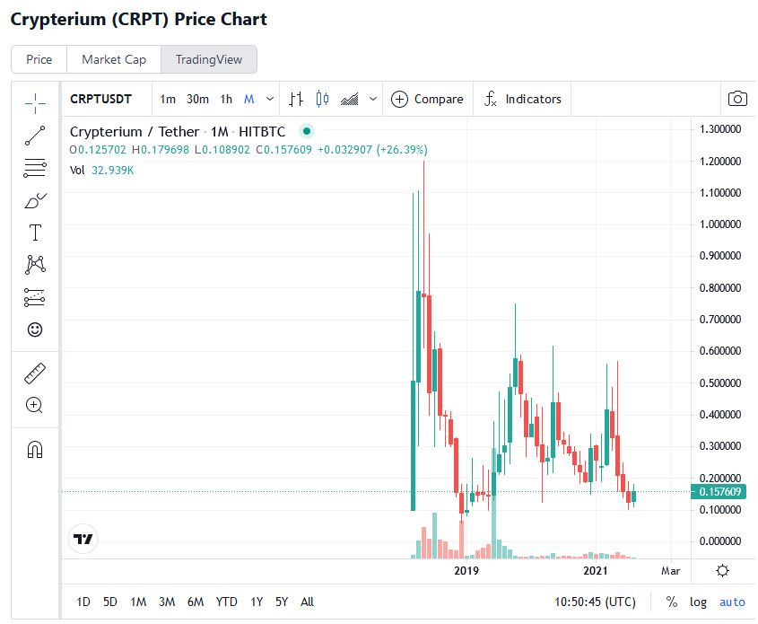
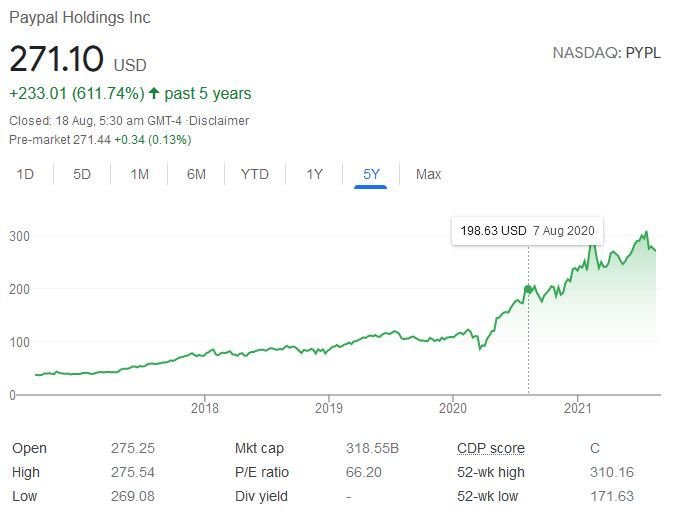
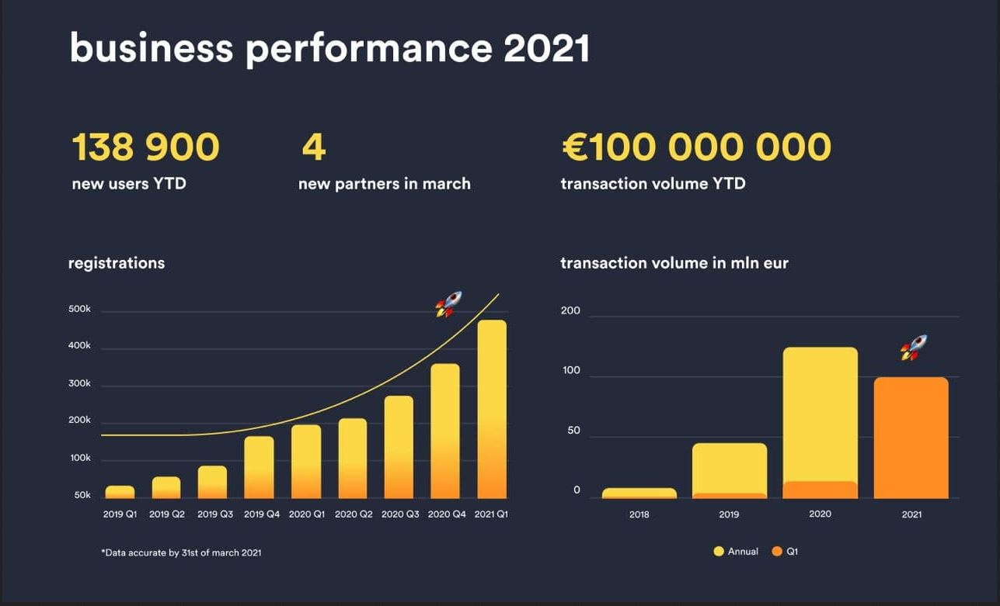
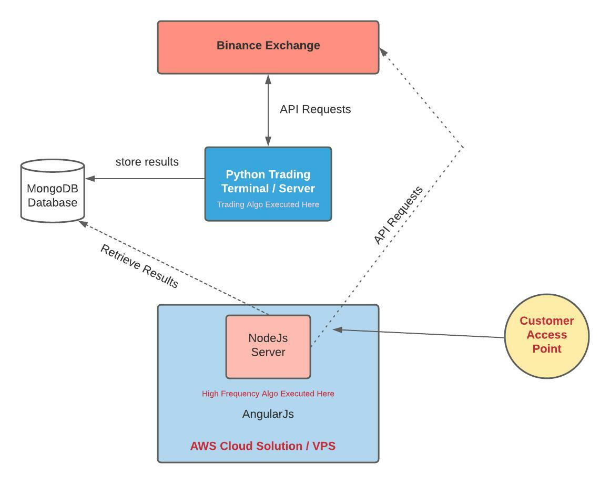

# Fintech Case Study on the Blockchain & Cryptocurrencies Domain

The introduction of cryptocurrencies into the global financial system has led to the growth of a new sector of finance known as **FinTech**. It is largely characterised by technological innovation, which is redefining the nature and structure of traditional areas of finance. The development of cryptocurrencies has emerged from this trend. It is defined by unique characteristics, such as the decentralisation of financial functions, anonymity of the players involved, and privacy in financial transactions. 

The purpose of this case study is to look at what are cryptocurrencies, how do they work and are there any legal barriers in this sector. We will also research a company in this domain, review their line of business and try to understand what business problems they are trying to solve and propose recommendations to the company on additional products or services they could implement to further grow their business.  

# What is a Cryptocurrency
A cryptocurrency is digital asset that is designed to work as a medium of exchange that uses strong cryptography to secure financial transactions, control the creation of additional units and verify the transfer of assets.

 

## Cryptocurrency Transactions
All transactions done using a cryptocurrency are authenticated by a network of peers who maintain that currency. Once all the peers on the network confirm the private key and validate the transaction, the transaction is recorded. As long as the transaction is unconfirmed by its peers, it is said to be pending and it can be forged. But once the transaction is confirmed, it is set in stone. It cannot be changed, it cannot be reversed and it becomes a part of the blockchain containing the records of all historical transactions of that currency.

 

## Major Cryptocurrencies 
Based on the data from **CoinMarketCap**, there are more than 7000 cryptocurrencies and new tokens are being created all the time each with a different use case and backstory. Below is the top 5 major cryptocurrencies and their respective prices:  

|Name       | Market Cap     | Price     |
| :------------- | :---------- | :----------- |
|   | $872,293,609,542   | $46,551.51    |
|    | $374,332,718,265 | $3,210.28 |
|    | $71,815,200,630 | $429.40 |
|    | $68,104,451,641 | $2.13  |
|    | $64,069,940,589 | $1.00  |

Since cryptocurrencies are one of the most volatile markets, these rankings will keep changing each day.

## Wallet / E-wallet

To trade or perform cryptocurrency transactions, a cryptocurrency wallet is required. In general, a wallet stores the private key, secure digital code known only to you and your wallet and public key, which is a public digital code connected to a certain amount of currency. It allows you to send and receive coins and also acts as a personal ledger of transactions as well as manage all your digital assets in one secure place.

To send digital currency from one account to another party, one would need to know the address or the alphanumerical value associated with the receiver's wallet. This value is known as the hash address. It is also important to note that **transactions on wallet's cannot be reversed**.

Some of the key advantages of using a wallet are:
* Simple and convenient to use
* Fast settlements compared to transaction done without using wallets as they have mining teams of their own
* Secure transactions and complete anonymity

While there are advantages, using a digital wallet also comes with risks as well:
* Risks of online hacks and scams
* Sending coins to the wrong address could lead to loss as all transactions are irreversible
  
# Legal Status
The law that governs the use of cryptocurrencies is still very grey all around the world and could vary from country-to-country and state-to-state. FinTech regulation is a relatively unexplored area of research because it offers a new way of financial modelling. The legality of the use of digital currencies is also under review because cryptocurrencies outline a decentralised model that operates outside of the conventional judicial framework. Therefore, the need to explore legal issues pertaining to cryptocurrencies emanated from the failure of different countries to account for the threats that cryptocurrencies introduce to the global financial system. For example, although money laundering is a comprehensively explored area of research and a threat to the conventional financial system, it is not explored in a similar manner in FinTech. 

Cryptocurrencies and FinTech are new areas of financial innovation. They are distinguished by their unique features, which make them stand out from traditional instruments of finance. The lack of a common authority is one of the main design features of cryptocurrencies, which distinguish it from fiat currencies.

Research sources suggests that in particular for Australia, performing business activities using cryptocurrencies is perfectly legal however, any capital gains tax must be declared and any individual or company who wish to operate a cryptocurrency exchange must register with **AUSTRAC** and meet **AML/CTF** compliance and reporting obligations.  

# Company Research - Crypterium
In this section we will research the company **Crypterium** and provide a general overview of the company, when it was formed and try to understand the company's vision and the key driving factors that led to starting this company in the first place.  

## Company Profile

| Description | Details |
| --- | --- |
| Company Name | Crypterium |
| Date Incorporated | Oct 16, 2017 |
| Founders | Austin Kimm, Gleb Markov, Vladimir Gorbunov |
| Funding Amount | $21.6M |
| Funding Type | Crowd Funding |
| # Employees | 13 |
| Industries | Banking, Blockchain, Cryptocurrency, FinTech |

The idea that came about which lead to the birth of Crypterium was at the time, over the past decade there had been an explosion in the demand and growth for cashless and digital payments and it seems that we are slowly guided into a cashless society however, at that stage universal transaction processing for cryptocurrency against fiat based goods were non-existance. Crypterium seek to solve this problem by launching a global banking transaction processing platform.  

## Business Activities
As mentioned previously, Crypterium is trying the problem where many users of cryptocurrencies are stuck with various digital assets and are unable to spend them in exchange for goods similar to that offered by fiat currencies. The vision of Crypterium was that they believed the future of the digital money era will be here to stay and wanted to embrace and motivate the use of this technology. They wanted to allow people to be able to store, spend, exchange cryptocurrency in the same way as they could with any other currency but in a quicker, cheaper and more secure environment than that of the traditional bank or fiat currency. 

The company's intended customers are anyone who uses fiat or cryptocurrencies but particularly users of cryptocurrencies who wish to be able to spend them anywhere in the world on the go just as you do with your EFTPOS or credit card. In order to achieve this goal, Crypterium took advantage of the current existing contactless payment technology and implmented it in the same manner but instead of using it where it is tied to the traditional fiat currencies, applied the technology to cryptocurrencies through personal smartphones. Essentially, Crypterium provides a mobile application built on IOS, Android and Windows smartphones. The app allows instant payments in cryptocurrencies using existing payment infrastructure such as NFC terminals or QR Codes.  

## Landscape
This company falls under several financial industry domains such as banking, blockchain & cryptocurrency and payments systems and they have since started looking into the lending sector.

The trends, analysis and projection on the contactless payment technology used by crypterium can be seen below:  

Thorough research was conducted by the Crypterium team prior to launching and based on the data provided, it looks very convincing that we would eventually end up as a cashless society. At the time of launching, Crypterium had no real competition in the crypto space so the only other competition was with other contactless payment companies like Apple Pay, Google Pay and Alipay but they were not really in direct competition with Crypterium.   

## Results
The company started off really well at an initial price of $0.11 and took off all the way to $1.30 in a matter of months but nearing the end of 2019 started declining.

  

Comparing Crypterium results to its closest rival Paypal below:

  

Though the results looks very different, it would not be a very fair comparison as Paypal is not a company that only offers payment using contactless card technologies, they also provides other services such as payment processing for ecommerce stores like Ebay. There would be other factors that may influence Crypterium's drop in price for its tokens.

Crypterium's current token price does not really reflect the true nature of their business. In reality, the correct metrics to measure the company's success is based on the following and these metrics are just for March 2021:
* The number of new registrations
* Revenue from all transactions and subsrcriptions ($400,000)
* Volume of B2B partner transactions ($600,000) 
* Number of new partners
* Number of CRPT tokens burned (121,000)

The company's performances to date can be seen below:  
  

Overall, Crypterium's performances since the beginning has been outstanding. Over the past couple of years, the company's growth appear to be almost exponential. It is likely that this continual growth could be explained by the zero transaction fees the company offers on all cryptocurrency purchases against the CRPT tokens and this however will not be the only factor influencing Crypterium's growth, we should expect to see further growth for the years to come.    

## Recommendations 
If I was appointed to be one of the advisors for the company, one of the other products I would propose to the company to include in their services would be **Robo Advisors**.

There are several reasons to offer this product into the business. Crypterium's main line of business is to allow users or holders of cryptocurrencies to be able to spend them at any outlet in the world using the cryptocurrencies they have without having to convert them back to cash, just as they are able to do so with fiat currencies. By offering Robo Advisor services into the business, this would most likely promote more user registrations with the majority of them coming from the traditional banking sector as the returns offered through Robo Advisor services are generally more attractive than those offered by traditional banks.

This additional service creates a domino effect for earnings, the increase in user registrations from the Robo Advisor service would also lead to the increase in cryptocurrency spending through Crypterium's mobile application platform. As you can see from the chart above, these are all indicators that measure how well the company is performing and there is no reason to doubt that this extra service offered by Crypterium would negatively impact their performance for the next quarter and beyond.

The following are examples the technologies that would be used for this additional service:
* **AngularJs** 
This is used for the frontend interface for users to interact with inside the platform

* **Python** 
Instead of building all the statistical libraries in Angularjs we will leverage existing libraries already built in python designed specifically for timeseries analysis and algorithmic trading decision making. It would be much faster to use existing functionalities available in other languages than reinvent the wheel. It is also more practical as well.

* **AWS Cloud Solution / VPS at different co-locations** 
This is needed to have the best resource for server performance and also optimal fail-safe scenario setup here. The company would also save money financially as they would not need to have their own inhouse server setup and require cyber security consultants to maintain security.  Machine learning algorithms can also be implemented here as well. Co-location is particularly important if we need to implement such strategies as high frequency trading and latency arbitrage techniques.

* **API** 
We need this to request price quotes and interact with the exchange. To make trading decisions, we need to know the orderbook and the prices available and act on them based on the strategies.

* **NodeJs** 
This will be used to host the webserver(AngularJs) customers can login and see balances and performances in their portfolio

* **MongoDB** 
MongoDB is one of the fastest databases out there to work with big data. We need this to store financial data as well as user profiles and configurations.

* **Trading and machine learning algorithms** 
The core of the Robo Advisors are dependent on the algorithms we design for them to run on so it is important we carefully test them thoroughly and deploy ones that trades profitably otherwise it would be a disaster and will lead to loss of business. 

A technology setup could look something like this:  
  
  
# References and Resources

Rosic, A. (2020). *What is Cryptocurrency? [Everything You Need To Know!].* [https://blockgeeks.com/guides/what-is-cryptocurrency/](https://blockgeeks.com/guides/what-is-cryptocurrency/).

NOWPayments.io (2020). *The basics of Cryptocurrency transactions* [https://nowpayments.io/blog/the-basics-of-crypto-transactions](https://nowpayments.io/blog/the-basics-of-crypto-transactions)

Trade Finance Global (2021). *What are Cryptocurrencies?* [https://www.tradefinanceglobal.com/blockchain/cryptocurrencies-what-are-they/](https://www.tradefinanceglobal.com/blockchain/cryptocurrencies-what-are-they/)

Frankenfield, J. (2021). *Cryptocurrency* [https://www.investopedia.com/terms/c/cryptocurrency.asp](https://www.investopedia.com/terms/c/cryptocurrency.asp).

Tassev, L. (2021). *Regulation* [https://news.bitcoin.com/cryptocurrency-swap-not-banned-in-iran-presidents-legal-team-says/](https://news.bitcoin.com/cryptocurrency-swap-not-banned-in-iran-presidents-legal-team-says/)

Cone, M. (2021). *Markdown Guide* [https://www.markdownguide.org](https://www.markdownguide.org)

Strahl, R. (2017). *Getting Images into Markdown Documents and Weblog Posts with Markdown Monster* [https://medium.com/markdown-monster-blog/getting-images-into-markdown-documents-and-weblog-posts-with-markdown-monster-9ec6f353d8ec](https://medium.com/markdown-monster-blog/getting-images-into-markdown-documents-and-weblog-posts-with-markdown-monster-9ec6f353d8ec)

Torpey, K. (2015). *Peter Todd Explains the Problems with Unconfirmed Bitcoin Transactions* [https://www.coingecko.com/buzz/peter-todd-explains-the-problems-with-unconfirmed-bitcoin-transactions](https://www.coingecko.com/buzz/peter-todd-explains-the-problems-with-unconfirmed-bitcoin-transactions)

CoinMarketCap (2021). *Today's Cryptocurrency Prices by Market Cap* [https://coinmarketcap.com/](https://coinmarketcap.com/)

Sephton, C. (2020). *How many cryptocurrencies are there?* [https://currency.com/how-many-cryptocurrencies-are-there](https://currency.com/how-many-cryptocurrencies-are-there)

Coinbase (2021). *What is a crypto wallet* [https://www.coinbase.com/learn/crypto-basics/what-is-a-crypto-wallet](https://www.coinbase.com/learn/crypto-basics/what-is-a-crypto-wallet)

Investdiva (2018). *5 Types of Cryptocurrency Wallets and Their Pros & Cons* [https://investdiva.com/investing-guide/types-of-cryptocurrency-wallets/](https://investdiva.com/investing-guide/types-of-cryptocurrency-wallets/)

Wikipedia (2021). *Legality of bitcoin by country or territory* [https://en.wikipedia.org/wiki/Legality_of_bitcoin_by_country_or_territory#Australasia](https://en.wikipedia.org/wiki/Legality_of_bitcoin_by_country_or_territory#Australasia)

Green, J.M (2021). *What Are the Laws for Cryptocurrency?* [https://www.thebalance.com/what-are-the-laws-for-cryptocurrency-5121102](https://www.thebalance.com/what-are-the-laws-for-cryptocurrency-5121102)

Finder (2021). *Legal stances towards cryptocurrency around the world* [https://www.finder.com/global-cryptocurrency-regulations](https://www.finder.com/global-cryptocurrency-regulations)

Crunchbase (2021). *Organisation Search Engine* [https://www.crunchbase.com/organization/crypterium/technology](https://www.crunchbase.com/organization/crypterium/technology)

Whitepaper (2021). *Make better investments with whitepaper* [https://whitepaper.io/](https://whitepaper.io/)

Reddit (2021). *Crypterium performance results* [https://www.reddit.com/r/crypterium_com/comments/mqfwfn/crypterium_performance_results_for_march_2021/](https://www.reddit.com/r/crypterium_com/comments/mqfwfn/crypterium_performance_results_for_march_2021/)

Crypterium (2021). *Zero Fees For CRPT Purchase* [https://crypterium.com/news/post/zero-fees-for-crpt-purchase?utm_source=telegram&utm_medium=news&utm_campaign=payin&utm_term=zero-fees-for-crpt-purchase](https://crypterium.com/news/post/zero-fees-for-crpt-purchase?utm_source=telegram&utm_medium=news&utm_campaign=payin&utm_term=zero-fees-for-crpt-purchase)

Huffman, L (2020). *Best 40+ Performing Robo-Advisors by ROI in 2021* [https://www.supermoney.com/best/robo-advisors/roi/](https://www.supermoney.com/best/robo-advisors/roi/)

Stockspot (2021). *Successful investing simplified* [https://www.stockspot.com.au/](https://www.stockspot.com.au/)